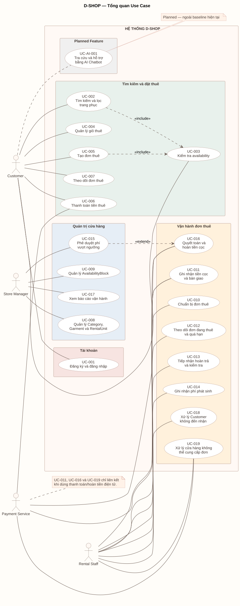

# Use Case Overview

Use Case Overview mô tả các chức năng chính của D-SHOP theo từng actor.

[PlantUML source](../assets/diagrams/use-case-overview.puml)

## Actors

| Actor | Vai trò |
| --- | --- |
| Customer | Tìm kiếm, đặt thuê, thanh toán và theo dõi đơn |
| Rental Staff | Chuẩn bị, bàn giao, nhận trả và xử lý đơn thuê |
| Store Manager | Quản lý tài sản, nhân viên, chính sách và phê duyệt |
| Payment Service | Hỗ trợ xử lý thanh toán điện tử |

## Use Cases

| ID | Use Case | Actor |
| --- | --- | --- |
| UC-001 | Đăng ký và đăng nhập | Customer |
| UC-002 | Tìm kiếm và lọc trang phục | Customer |
| UC-003 | Kiểm tra availability | Customer |
| UC-004 | Quản lý giỏ thuê | Customer |
| UC-005 | Tạo đơn thuê | Customer |
| UC-006 | Thanh toán tiền thuê | Customer, Payment Service |
| UC-007 | Theo dõi đơn thuê | Customer |
| UC-008 | Quản lý Category, Garment và RentalUnit | Store Manager |
| UC-009 | Quản lý AvailabilityBlock | Store Manager |
| UC-010 | Chuẩn bị đơn thuê | Rental Staff |
| UC-011 | Ghi nhận tiền cọc và bàn giao | Rental Staff, Payment Service (tùy phương thức) |
| UC-012 | Theo dõi đơn đang thuê và quá hạn | Rental Staff |
| UC-013 | Tiếp nhận hoàn trả và kiểm tra | Rental Staff |
| UC-014 | Ghi nhận phí phát sinh | Rental Staff |
| UC-015 | Phê duyệt phí vượt ngưỡng | Store Manager |
| UC-016 | Quyết toán và hoàn tiền cọc | Rental Staff, Payment Service (nếu tích hợp) |
| UC-017 | Xem báo cáo vận hành | Store Manager |
| UC-018 | Xử lý Customer không đến nhận | Rental Staff |
| UC-019 | Xử lý cửa hàng không thể cung cấp đơn | Rental Staff, Payment Service (nếu hoàn điện tử) |

## Use Case Relationships

- UC-002 bao gồm UC-003 vì kết quả tìm kiếm theo lịch phụ thuộc kiểm tra availability.
- UC-005 bao gồm UC-003 vì tạo đơn phải kiểm tra lại availability.
- UC-015 mở rộng UC-016 khi phí vượt ngưỡng hoặc có sự cố nghiêm trọng/mất đồ; UC-016 vẫn là use case quyết toán cơ sở.

## Planned Use Case

| ID | Use Case | Actor | Status |
|---|---|---|---|
| UC-AI-001 | Tra cứu và hỗ trợ bằng AI Chatbot | Customer | Planned |

## Detailed Specifications

Chi tiết Use Case được trình bày tại:

- [Customer Use Cases](uc-customer.md)
- [Rental Staff Use Cases](uc-rental-staff.md)
- [Store Manager Use Cases](uc-store-manager.md)
