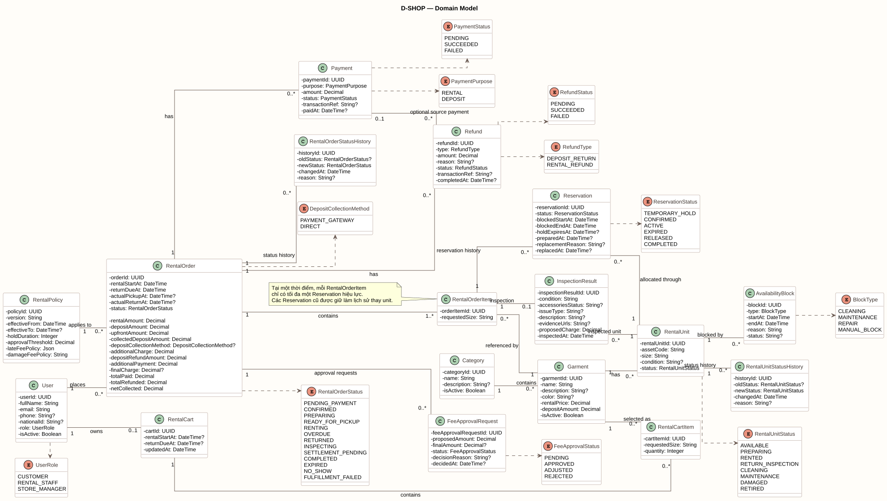

# Domain Model

Domain Model mô tả các đối tượng nghiệp vụ chính và mối quan hệ giữa chúng trong D-SHOP.

[PlantUML source](../assets/diagrams/domain-model.puml)

## Core Entities

| Entity | Mô tả |
| --- | --- |
| User | Người sử dụng hệ thống gồm Customer, Rental Staff và Store Manager |
| Category | Danh mục trang phục |
| Garment | Mẫu trang phục được cung cấp cho thuê |
| RentalUnit | Một món trang phục vật lý cụ thể thuộc Garment |
| AvailabilityBlock | Khoảng thời gian RentalUnit không thể được đặt thuê |
| RentalPolicy | Chính sách áp dụng cho hoạt động thuê và tính phí |
| RentalCart | Giỏ thuê của Customer |
| RentalCartItem | Trang phục được Customer thêm vào giỏ |
| RentalOrder | Đơn thuê của Customer |
| RentalOrderItem | Một trang phục trong RentalOrder |
| Reservation | Khoảng thời gian một RentalUnit được giữ cho RentalOrderItem |
| Payment | Giao dịch thanh toán hoặc ghi nhận tiền liên quan đến đơn thuê |
| InspectionResult | Kết quả kiểm tra RentalUnit sau khi hoàn trả |
| FeeApprovalRequest | Yêu cầu Store Manager phê duyệt khoản phí vượt ngưỡng |
| Refund | Khoản tiền được hoàn lại cho Customer |
| RentalOrderStatusHistory | Lịch sử thay đổi trạng thái RentalOrder |
| RentalUnitStatusHistory | Lịch sử thay đổi trạng thái RentalUnit |

## Cardinality Summary

| Quan hệ | Cardinality |
| --- | --- |
| User - RentalCart | Một User có tối đa một RentalCart; mỗi RentalCart thuộc một User |
| User - RentalOrder | Một User có thể có nhiều RentalOrder; mỗi RentalOrder thuộc một User |
| RentalPolicy - RentalOrder | Một RentalPolicy áp dụng cho nhiều RentalOrder; mỗi RentalOrder chụp đúng một policy |
| Category - Garment | Một Category có nhiều Garment; mỗi Garment thuộc một Category |
| Garment - RentalUnit | Một Garment có nhiều RentalUnit; mỗi RentalUnit thuộc một Garment |
| RentalCart - RentalCartItem | Một RentalCart có nhiều RentalCartItem; mỗi item thuộc một cart |
| Garment - RentalCartItem | Một Garment có thể xuất hiện trong nhiều cart item; mỗi cart item tham chiếu một Garment |
| RentalOrder - RentalOrderItem | Một RentalOrder có từ một RentalOrderItem trở lên; mỗi item thuộc một order |
| Garment - RentalOrderItem | Một Garment có thể xuất hiện trong nhiều order item; mỗi order item tham chiếu một Garment |
| RentalOrderItem - Reservation | Một item có thể có nhiều Reservation lịch sử; mỗi Reservation thuộc một item |
| RentalUnit - Reservation | Một unit có thể xuất hiện trong nhiều Reservation theo thời gian; mỗi Reservation phân bổ một unit |
| RentalOrder - Payment / Refund / FeeApprovalRequest / StatusHistory | Một order có thể có nhiều bản ghi thuộc từng loại |
| Payment - Refund | Một Refund có thể không tham chiếu Payment; nếu có thì tham chiếu tối đa một Payment. Một Payment có thể là nguồn của nhiều Refund |
| RentalOrderItem - InspectionResult | Mỗi item có tối đa một InspectionResult |
| RentalUnit - InspectionResult / StatusHistory / AvailabilityBlock | Một unit có thể có nhiều bản ghi thuộc từng loại |

## Allocation Invariant

`RentalOrderItem` không trỏ trực tiếp tới `RentalUnit`; việc phân bổ vật lý đi qua `Reservation`.

Tại một thời điểm, mỗi `RentalOrderItem` chỉ được có tối đa một Reservation hiệu lực. Các Reservation cũ vẫn được giữ lại để bảo toàn lịch sử khi thay RentalUnit.
