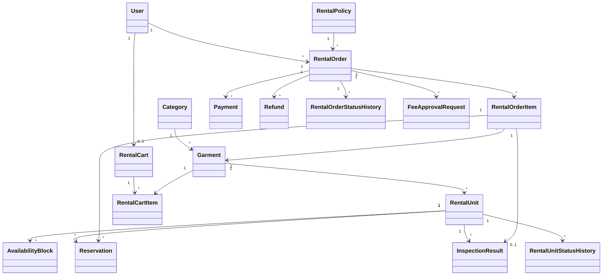

# Domain Model

Domain Model mô tả các đối tượng nghiệp vụ chính và mối quan hệ giữa chúng trong D-SHOP.

## Core Entities

| Entity | Mô tả |
| --- | --- |
| User | Người sử dụng hệ thống gồm Customer, Rental Staff và Store Manager |
| Category | Danh mục trang phục |
| Garment | Mẫu trang phục được cung cấp cho thuê |
| RentalUnit | Một món trang phục vật lý cụ thể thuộc Garment |
| AvailabilityBlock | Khoảng thời gian RentalUnit không thể được đặt thuê |
| RentalPolicy | Chính sách áp dụng cho hoạt động thuê và tính phí |
| RentalCart | Giỏ thuê của Customer |
| RentalCartItem | Trang phục được Customer thêm vào giỏ |
| RentalOrder | Đơn thuê của Customer |
| RentalOrderItem | Một trang phục trong RentalOrder |
| Reservation | Khoảng thời gian một RentalUnit được giữ cho RentalOrderItem |
| Payment | Giao dịch thanh toán hoặc ghi nhận tiền liên quan đến đơn thuê |
| InspectionResult | Kết quả kiểm tra RentalUnit sau khi hoàn trả |
| FeeApprovalRequest | Yêu cầu Store Manager phê duyệt khoản phí vượt ngưỡng |
| Refund | Khoản tiền được hoàn lại cho Customer |
| RentalOrderStatusHistory | Lịch sử thay đổi trạng thái RentalOrder |
| RentalUnitStatusHistory | Lịch sử thay đổi trạng thái RentalUnit |

## Main Relationships

`RentalOrderItem` không trỏ trực tiếp tới `RentalUnit`; việc phân bổ RentalUnit được biểu diễn qua `Reservation`. `FeeApprovalRequest` thuộc `RentalOrder`, còn bằng chứng/InspectionResult được dùng làm dữ liệu xem xét nghiệp vụ.
