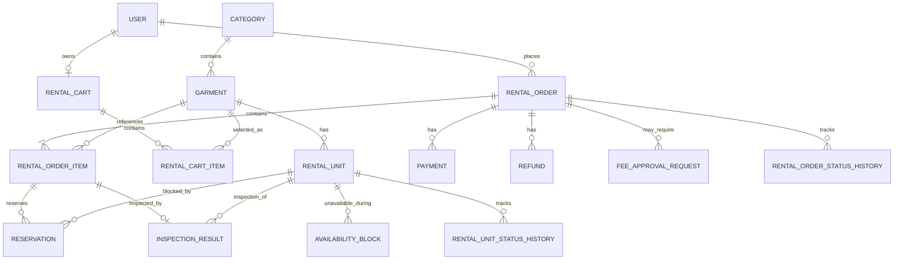

# Entity Relationship Diagram

ERD mô tả các thực thể dữ liệu chính và quan hệ giữa chúng trong D-SHOP.

> Đây là ERD ở mức nghiệp vụ.
> Tên bảng, field, datatype, index và constraint kỹ thuật sẽ được đối chiếu với database schema khi thiết kế chi tiết.

## ERD

Phân bổ vật lý đi qua `RESERVATION` (`RENTAL_ORDER_ITEM -> RESERVATION -> RENTAL_UNIT`), không có quan hệ trực tiếp từ `RENTAL_ORDER_ITEM` sang `RENTAL_UNIT` trong schema hiện tại.
