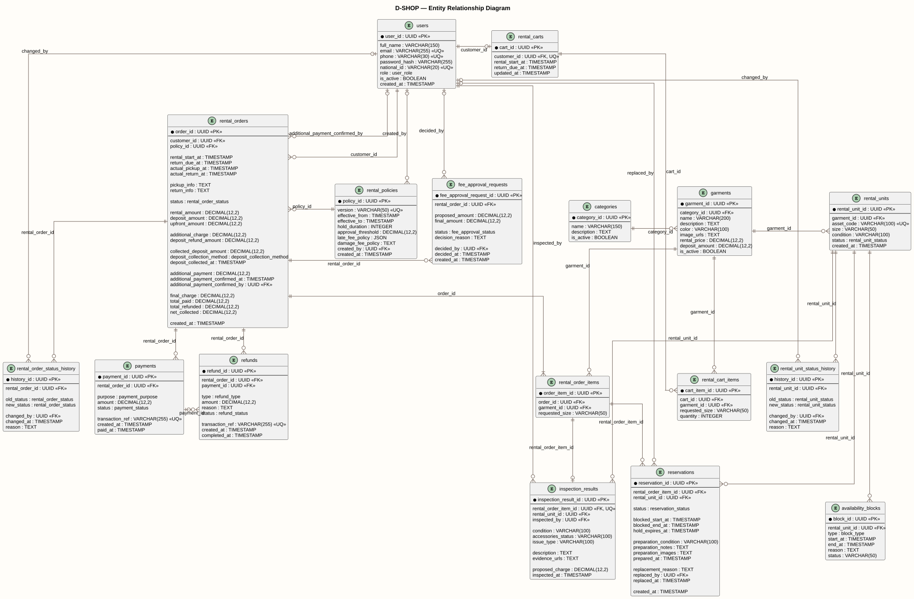

# Entity Relationship Diagram

ERD mô tả các thực thể dữ liệu và quan hệ đang được D-SHOP sử dụng.

[PlantUML source](../assets/diagrams/erd.puml)

## Cardinality Notes

- `rental_orders.policy_id` là bắt buộc: mỗi RentalOrder dùng đúng một RentalPolicy, một policy có thể áp dụng cho nhiều order.
- `rental_orders` có ít nhất một `rental_order_items`; các quan hệ collection còn lại có thể rỗng.
- `rental_order_items` và `rental_units` liên kết qua `reservations`, không có FK trực tiếp từ order item sang unit.
- Mỗi `rental_order_item` có tối đa một `inspection_result`, trong khi một `rental_unit` có thể có nhiều inspection theo thời gian.
- `refunds.payment_id` là nullable: Refund có thể không gắn Payment, hoặc gắn tối đa một Payment; một Payment có thể được tham chiếu bởi nhiều Refund.
- Các FK audit/decision `rental_policies.created_by`, `reservations.replaced_by`, `fee_approval_requests.decided_by`, hai trường `changed_by` của status history và `rental_orders.additional_payment_confirmed_by` đều nullable.

## Reservation Invariant

Một RentalOrderItem có thể có nhiều Reservation lịch sử khi RentalUnit được thay thế, nhưng tại một thời điểm chỉ được có tối đa một Reservation hiệu lực.
