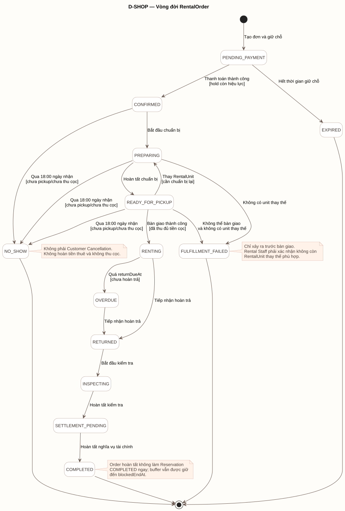
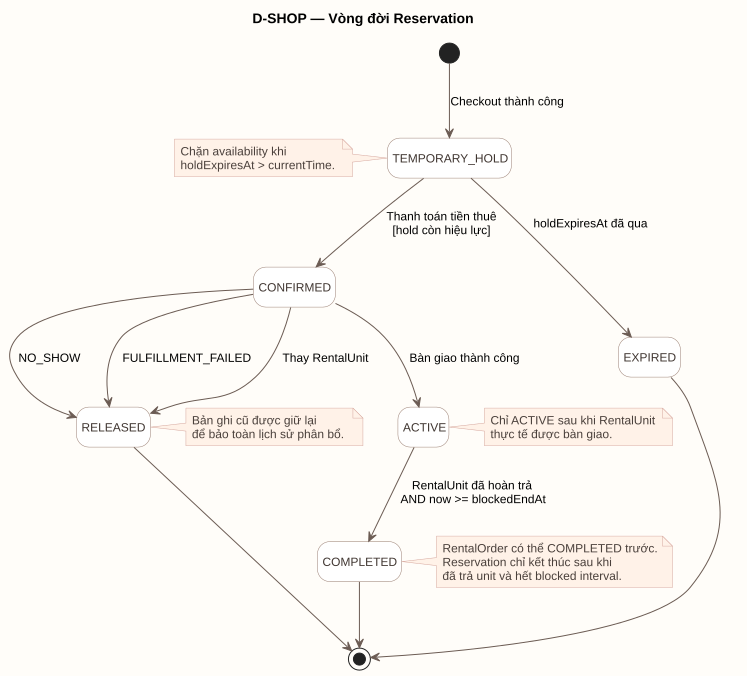
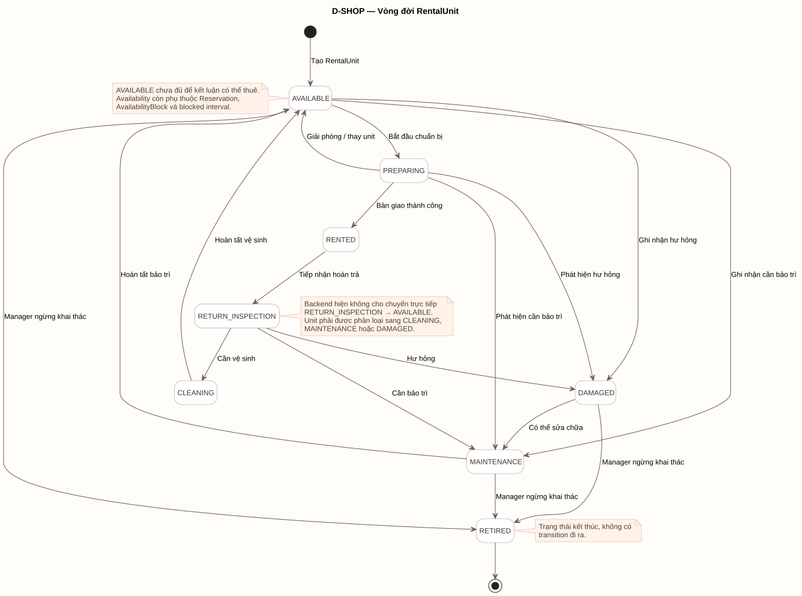

# State Models

State Models mô tả vòng đời trạng thái của các đối tượng nghiệp vụ chính trong D-SHOP. Các SVG dưới đây được sinh từ source PlantUML tương ứng.

## RentalOrder State

[PlantUML source](../assets/diagrams/rental-order-state.puml)

Các transition quan trọng:

- `PENDING_PAYMENT -> CONFIRMED` chỉ khi thanh toán thành công và hold còn hiệu lực; hold hết hạn dẫn tới `EXPIRED`.
- Luồng chuẩn bị là `CONFIRMED -> PREPARING -> READY_FOR_PICKUP`.
- Thay RentalUnit khi đơn đã sẵn sàng đưa order từ `READY_FOR_PICKUP` về `PREPARING` để chuẩn bị unit mới.
- `FULFILLMENT_FAILED` chỉ xuất phát từ `PREPARING` hoặc `READY_FOR_PICKUP`, sau khi xác nhận không còn unit thay thế.
- `NO_SHOW` chỉ xuất phát từ `CONFIRMED`, `PREPARING` hoặc `READY_FOR_PICKUP` sau 18:00 ngày nhận khi chưa pickup/chưa thu cọc.
- Bàn giao thành công chuyển `READY_FOR_PICKUP -> RENTING`; hoàn trả và kiểm tra đi qua `RETURNED -> INSPECTING -> SETTLEMENT_PENDING`.
- `SETTLEMENT_PENDING -> COMPLETED` chỉ khi toàn bộ nghĩa vụ tài chính đã hoàn tất.

`NO_SHOW` và `FULFILLMENT_FAILED` không phải Customer Cancellation.

## Reservation State

[PlantUML source](../assets/diagrams/reservation-state.puml)

- `TEMPORARY_HOLD -> CONFIRMED` khi thanh toán tiền thuê hợp lệ và hold còn hiệu lực; hold quá hạn chuyển `EXPIRED`.
- `CONFIRMED -> ACTIVE` chỉ khi RentalUnit thực tế được bàn giao.
- Reservation `CONFIRMED` chuyển `RELEASED` khi `NO_SHOW`, `FULFILLMENT_FAILED` hoặc thay RentalUnit.
- Reservation `ACTIVE` chỉ chuyển `COMPLETED` khi RentalUnit đã hoàn trả và `now >= blockedEndAt`.

RentalOrder `COMPLETED` không tự động làm Reservation `COMPLETED`; Reservation tiếp tục chặn availability đến hết `blockedEndAt`.

## RentalUnit State

[PlantUML source](../assets/diagrams/rental-unit-state.puml)

- Unit mới bắt đầu ở `AVAILABLE`; chuẩn bị và bàn giao đi qua `PREPARING -> RENTED`.
- Giải phóng hoặc thay unit trước bàn giao cho phép `PREPARING -> AVAILABLE`.
- `AVAILABLE` và `PREPARING` có thể chuyển sang `MAINTENANCE` hoặc `DAMAGED` khi phát hiện vấn đề.
- Hoàn trả chuyển `RENTED -> RETURN_INSPECTION`.
- Từ `RETURN_INSPECTION`, baseline hiện tại chỉ cho phép phân loại sang `CLEANING`, `MAINTENANCE` hoặc `DAMAGED`; không chuyển trực tiếp sang `AVAILABLE` hoặc `RETIRED`.
- `CLEANING` và `MAINTENANCE` có thể trở lại `AVAILABLE`; `DAMAGED` có thể chuyển sang `MAINTENANCE`.
- Store Manager có thể chuyển `AVAILABLE`, `MAINTENANCE` hoặc `DAMAGED` sang `RETIRED` khi không có Reservation hiệu lực. `RETIRED` là trạng thái kết thúc.

`AVAILABLE` chưa đủ để kết luận unit có thể thuê; availability còn phụ thuộc Reservation, AvailabilityBlock và blocked interval.
