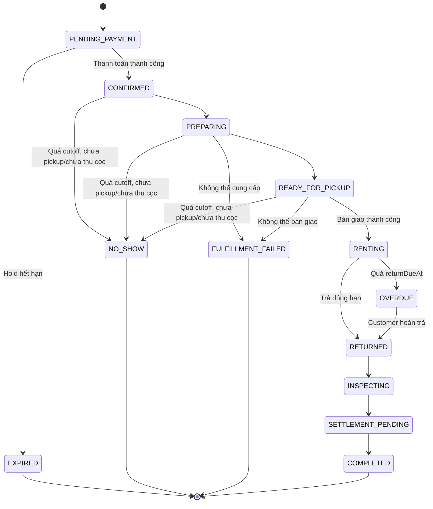
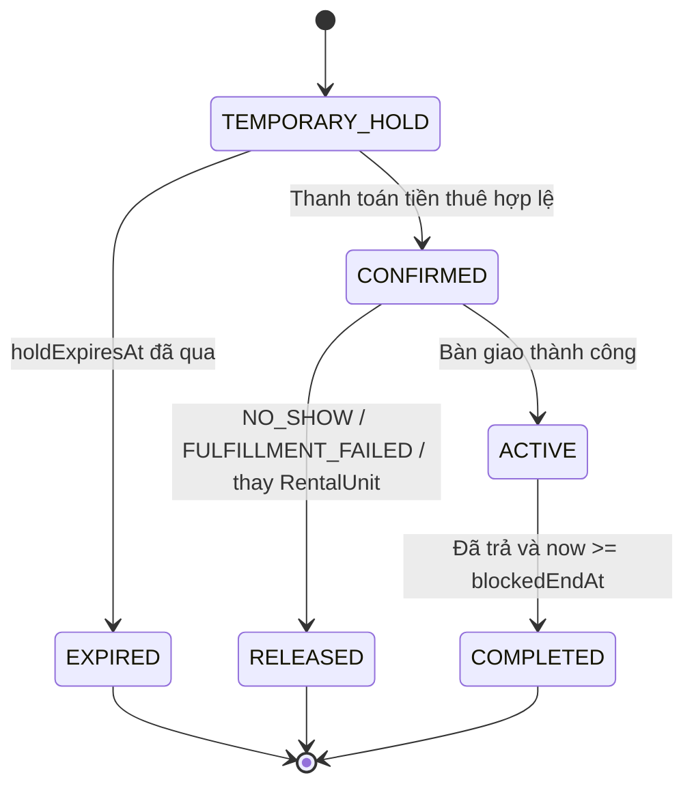
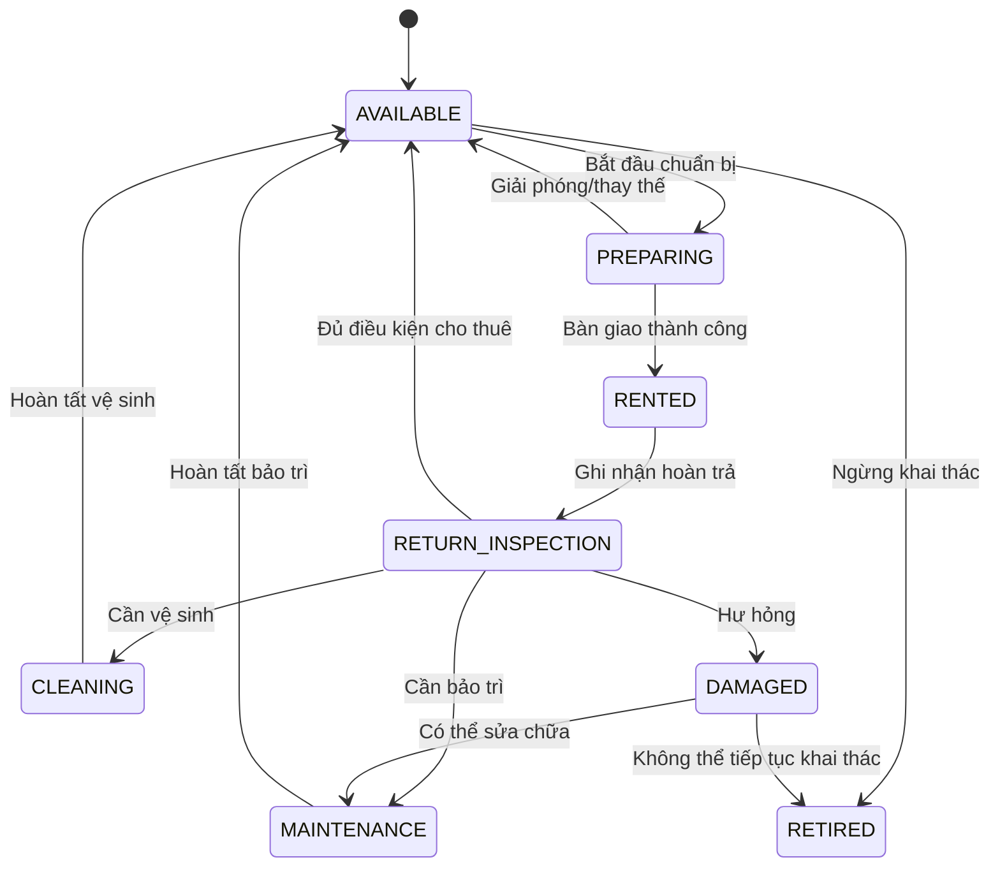

# State Models

State Models mô tả vòng đời trạng thái của các đối tượng nghiệp vụ chính trong D-SHOP.

## RentalOrder State

`NO_SHOW` chỉ áp dụng sau cutoff 18:00 ngày nhận khi chưa bàn giao/chưa thu cọc. `FULFILLMENT_FAILED` là lỗi thực hiện đơn của cửa hàng, không phải Customer Cancellation.

## Reservation State

RentalOrder `COMPLETED` không tự động làm Reservation `COMPLETED`. Reservation `ACTIVE` tiếp tục chặn availability đến hết `blockedEndAt`.

## RentalUnit State

