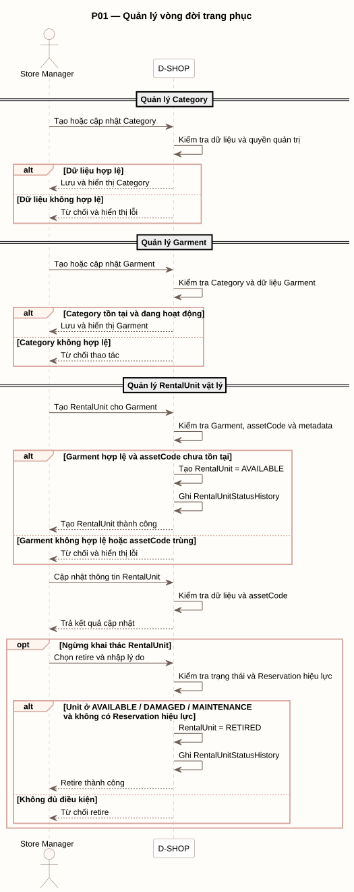

# P01 - Quản lý vòng đời trang phục

P01 mô tả cách Store Manager quản lý Category, Garment và từng RentalUnit vật lý.

[PlantUML source](../assets/diagrams/p01-garment-lifecycle.puml)

## Actors

- Store Manager
- D-SHOP

## Flow Summary

1. Store Manager tạo hoặc cập nhật Category; D-SHOP kiểm tra dữ liệu và quyền quản trị.
2. Store Manager tạo hoặc cập nhật Garment; Category phải tồn tại và đang hoạt động.
3. Khi tạo RentalUnit, hệ thống kiểm tra Garment, metadata và tính duy nhất của `assetCode`; unit mới ở `AVAILABLE` và có RentalUnitStatusHistory.
4. Khi cập nhật RentalUnit, hệ thống tiếp tục kiểm tra dữ liệu và `assetCode`.
5. Store Manager chỉ được retire unit ở `AVAILABLE`, `DAMAGED` hoặc `MAINTENANCE` khi không có Reservation hiệu lực; hệ thống ghi lịch sử trạng thái.

Các trường hợp dữ liệu không hợp lệ, Category/Garment không hợp lệ, `assetCode` trùng hoặc unit không đủ điều kiện retire đều bị từ chối.
