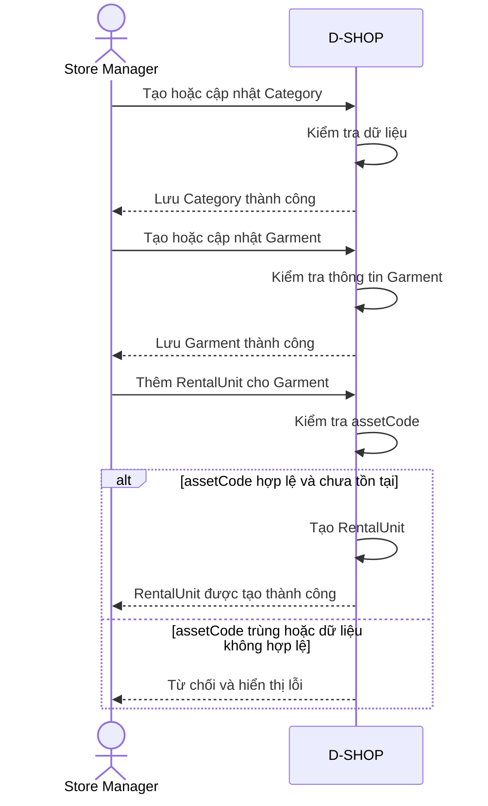

# P01 - Garment Lifecycle

P01 mô tả cách Store Manager quản lý danh mục trang phục, mẫu trang phục và các RentalUnit vật lý trong D-SHOP.

## Actors

- Store Manager
- D-SHOP

## Main Flow

```mermaid
sequenceDiagram
    actor Manager as Store Manager
    participant System as D-SHOP

    Manager->>System: Tạo hoặc cập nhật Category
    System->>System: Kiểm tra dữ liệu
    System-->>Manager: Lưu Category thành công

    Manager->>System: Tạo hoặc cập nhật Garment
    System->>System: Kiểm tra thông tin Garment
    System-->>Manager: Lưu Garment thành công

    Manager->>System: Thêm RentalUnit cho Garment
    System->>System: Kiểm tra assetCode

    alt assetCode hợp lệ và chưa tồn tại
        System->>System: Tạo RentalUnit
        System-->>Manager: RentalUnit được tạo thành công
    else assetCode trùng hoặc dữ liệu không hợp lệ
        System-->>Manager: Từ chối và hiển thị lỗi
    end
```
