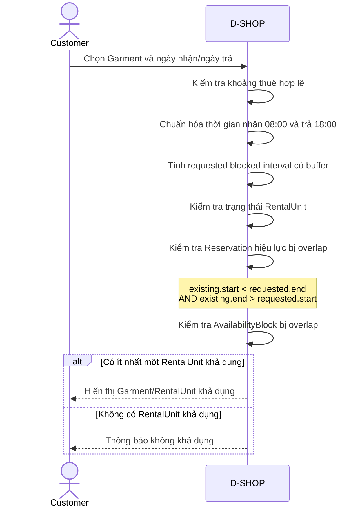

# P02 - Availability Check

P02 mô tả cách Customer kiểm tra khả dụng của Garment theo khoảng thời gian thuê và cách D-SHOP xác định RentalUnit có thể được phân bổ.

## Actors

- Customer
- D-SHOP

## Main Flow

