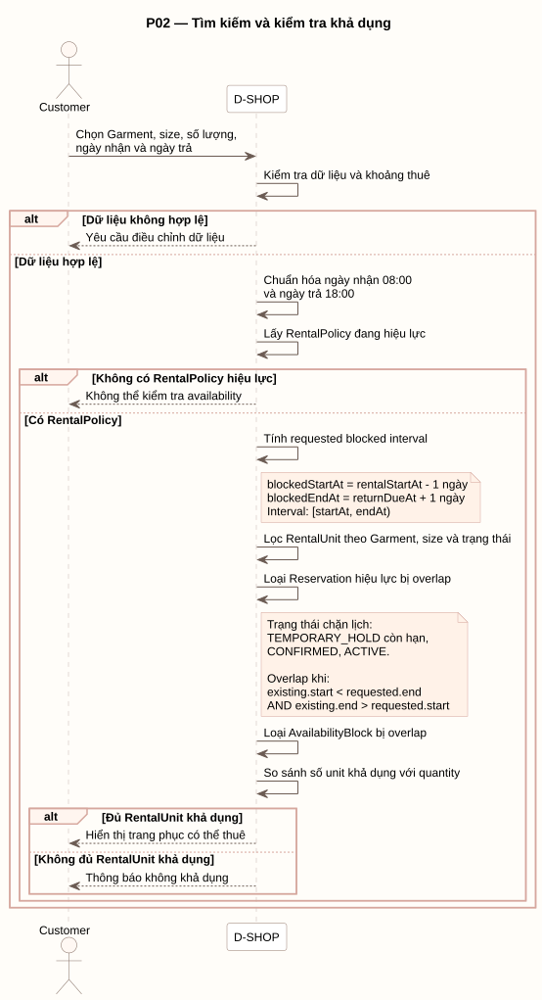

# P02 - Tìm kiếm và kiểm tra khả dụng

P02 mô tả cách Customer kiểm tra khả dụng theo Garment, size, số lượng và khoảng thời gian thuê.



[PlantUML source](../assets/diagrams/p02-availability.puml)

## Actors

- Customer
- D-SHOP

## Flow Summary

1. D-SHOP kiểm tra dữ liệu đầu vào và chuẩn hóa ngày nhận về 08:00, ngày trả về 18:00.
2. Hệ thống lấy RentalPolicy hiệu lực; nếu không có policy thì không thể kiểm tra availability.
3. Hệ thống tính `blockedStartAt = rentalStartAt - 1 ngày` và `blockedEndAt = returnDueAt + 1 ngày`.
4. Khoảng thời gian dùng quy ước nửa mở `[startAt, endAt)`.
5. Hệ thống lọc RentalUnit theo Garment, size và trạng thái.
6. Hệ thống loại Reservation hiệu lực bị overlap và AvailabilityBlock bị overlap.
7. Hệ thống chỉ trả kết quả khả dụng khi số RentalUnit còn lại đáp ứng quantity.

Reservation chặn lịch gồm `TEMPORARY_HOLD` còn hạn, `CONFIRMED` và `ACTIVE`. Hai khoảng overlap khi:

```text
existing.start < requested.end
AND existing.end > requested.start
```
