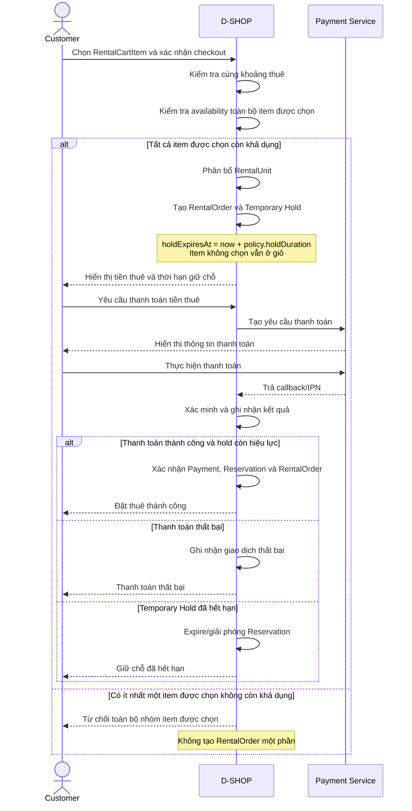

# P03 - Booking & Payment

P03 mô tả cách Customer chọn một hoặc nhiều item trong RentalCart để checkout, D-SHOP giữ tạm toàn bộ RentalUnit tương ứng và xác nhận đơn sau khi thanh toán tiền thuê thành công.

## Actors

- Customer
- D-SHOP
- Payment Service

## Main Flow

