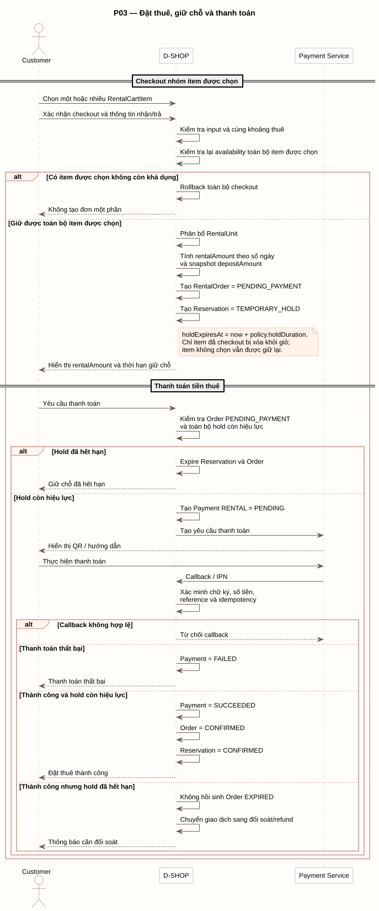

# P03 - Đặt thuê, giữ chỗ và thanh toán

P03 mô tả checkout nhóm item được chọn, giữ chỗ tạm thời và xác nhận đơn bằng thanh toán tiền thuê.

[PlantUML source](../assets/diagrams/p03-booking-payment.puml)

## Actors

- Customer
- D-SHOP
- Payment Service

## Flow Summary

1. Customer chọn một hoặc nhiều RentalCartItem và xác nhận thông tin nhận/trả.
2. D-SHOP kiểm tra input, yêu cầu các item dùng cùng khoảng thuê và kiểm tra lại availability toàn bộ nhóm.
3. Nếu có item không còn khả dụng, hệ thống rollback toàn bộ checkout và không tạo đơn một phần.
4. Nếu giữ được toàn bộ item, hệ thống phân bổ RentalUnit, tính tiền thuê theo số ngày, snapshot tiền cọc, tạo RentalOrder `PENDING_PAYMENT` và Reservation `TEMPORARY_HOLD`.
5. `holdExpiresAt = now + policy.holdDuration`; chỉ item đã checkout bị xóa khỏi giỏ.
6. Khi Customer yêu cầu thanh toán, D-SHOP kiểm tra lại order và toàn bộ hold trước khi tạo Payment `RENTAL/PENDING`.
7. Callback/IPN phải được xác minh chữ ký, số tiền, reference và idempotency.
8. Thanh toán thành công khi hold còn hiệu lực chuyển Payment sang `SUCCEEDED`, order sang `CONFIRMED` và Reservation sang `CONFIRMED`.

Nếu callback thành công sau khi hold đã hết hạn, hệ thống không hồi sinh order `EXPIRED`; giao dịch được chuyển sang đối soát/refund.
