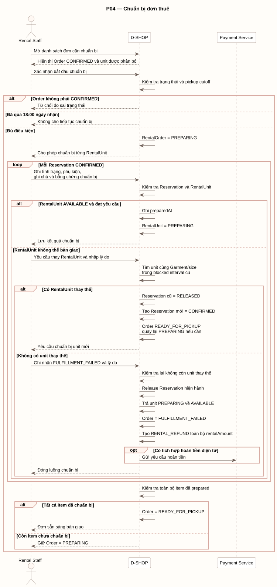

# P04 - Chuẩn bị đơn thuê

P04 mô tả cách Rental Staff chuẩn bị từng RentalUnit trước thời điểm bàn giao.

[PlantUML source](../assets/diagrams/p04-preparation.puml)

## Actors

- Rental Staff
- D-SHOP
- Payment Service, chỉ khi có tích hợp hoàn tiền điện tử

## Flow Summary

1. Staff mở danh sách order `CONFIRMED` và chọn bắt đầu chuẩn bị.
2. D-SHOP từ chối nếu order sai trạng thái hoặc đã qua 18:00 ngày nhận; nếu hợp lệ, order chuyển `PREPARING`.
3. Với mỗi Reservation `CONFIRMED`, Staff ghi tình trạng, phụ kiện, ghi chú và bằng chứng chuẩn bị.
4. Unit đạt yêu cầu chuyển `AVAILABLE -> PREPARING` và được ghi `preparedAt`.
5. Nếu unit không thể bàn giao, Staff yêu cầu unit thay thế cùng Garment/size và khả dụng trong blocked interval cũ.
6. Có unit thay thế: Reservation cũ chuyển `RELEASED`, Reservation mới được tạo ở `CONFIRMED`; order `READY_FOR_PICKUP` quay về `PREPARING` nếu cần chuẩn bị lại.
7. Không có unit thay thế: Staff ghi nhận `FULFILLMENT_FAILED`; hệ thống release Reservation, trả unit đang `PREPARING` về `AVAILABLE`, đóng order và tạo `RENTAL_REFUND` bằng toàn bộ rentalAmount.
8. Chỉ khi toàn bộ item đã chuẩn bị, order mới chuyển `READY_FOR_PICKUP`; nếu chưa đủ thì giữ `PREPARING`.
