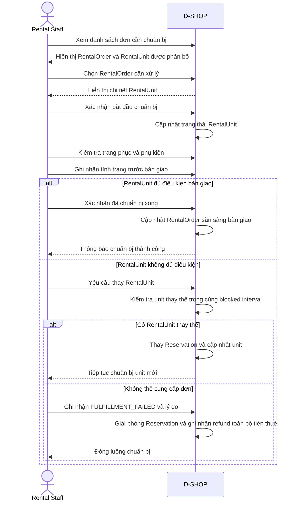

# P04 - Rental Preparation

P04 mô tả cách Rental Staff chuẩn bị các RentalUnit đã được phân bổ trước thời điểm Customer đến nhận.

## Actors

- Rental Staff
- D-SHOP

## Main Flow

Sau 18:00 ngày nhận, hệ thống từ chối bắt đầu/hoàn tất chuẩn bị cho đơn chưa bàn giao.
