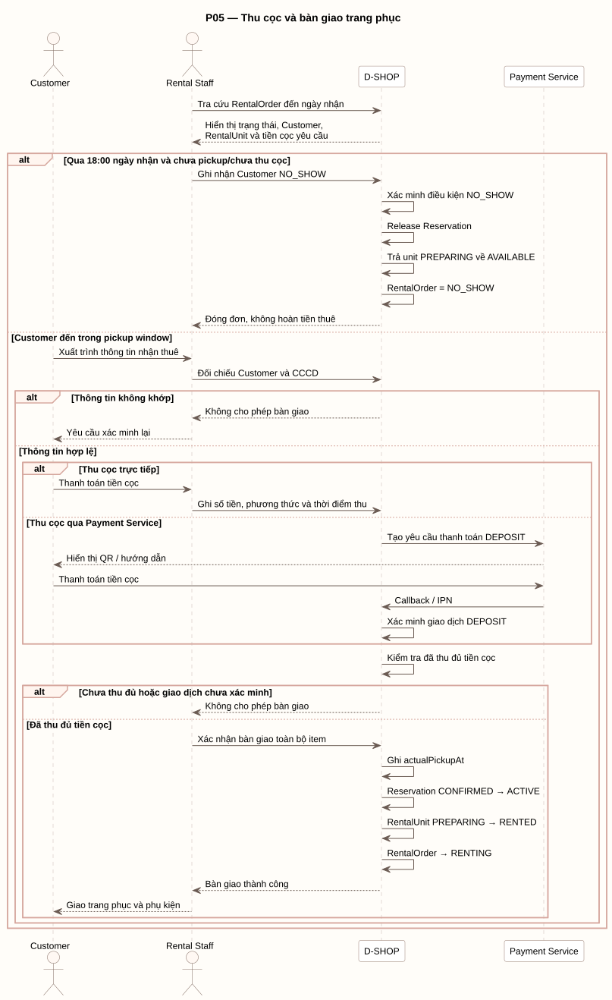

# P05 - Thu cọc và bàn giao trang phục

P05 mô tả cách Rental Staff đối chiếu Customer, thu đủ tiền cọc và bàn giao toàn bộ RentalUnit.

[PlantUML source](../assets/diagrams/p05-handover.puml)

## Actors

- Customer
- Rental Staff
- D-SHOP
- Payment Service, khi tiền cọc được thu điện tử

## Flow Summary

1. Staff tra cứu RentalOrder đến ngày nhận; D-SHOP hiển thị trạng thái, Customer, RentalUnit và tiền cọc yêu cầu.
2. Nếu đã qua 18:00 ngày nhận và chưa pickup/chưa thu cọc, Staff ghi nhận `NO_SHOW`; hệ thống xác minh điều kiện, release Reservation, trả unit `PREPARING` về `AVAILABLE` và đóng order. Tiền thuê không được hoàn.
3. Nếu Customer đến trong pickup window, Staff đối chiếu Customer và CCCD.
4. Tiền cọc có thể được Staff ghi nhận trực tiếp hoặc xác minh qua Payment Service.
5. Khi chưa thu đủ cọc hoặc giao dịch chưa được xác minh, hệ thống không cho phép bàn giao.
6. Khi đủ điều kiện, Staff xác nhận bàn giao toàn bộ item; hệ thống ghi `actualPickupAt`, chuyển Reservation `CONFIRMED -> ACTIVE`, RentalUnit `PREPARING -> RENTED` và RentalOrder sang `RENTING`.
