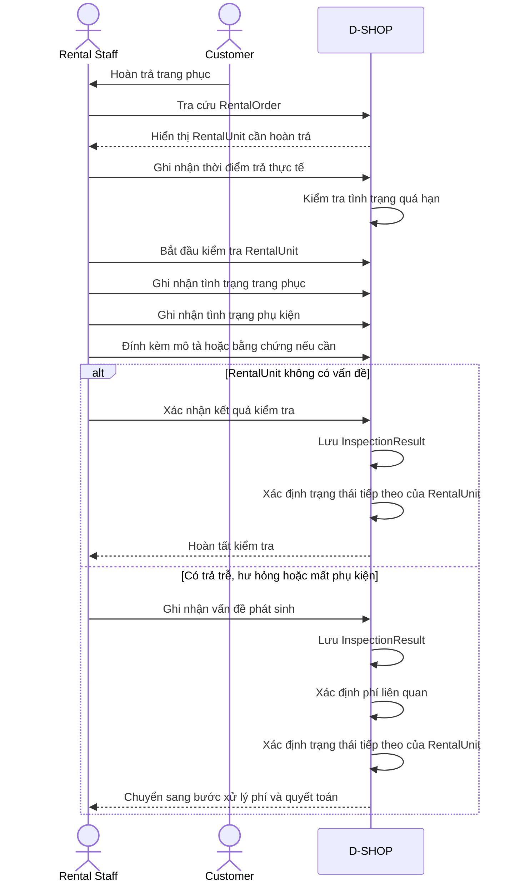

# P06 - Return & Inspection

P06 mô tả cách Rental Staff tiếp nhận RentalUnit được hoàn trả, kiểm tra tình trạng thực tế và ghi nhận các vấn đề phát sinh sau thời gian thuê.

## Actors

- Rental Staff
- Customer
- D-SHOP

## Main Flow

