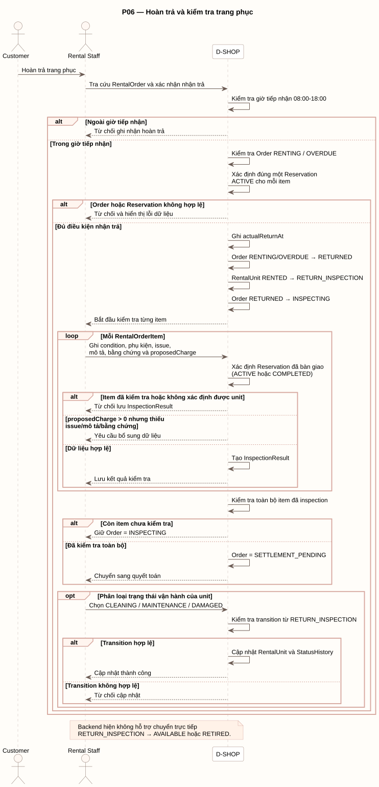

# P06 - Hoàn trả và kiểm tra trang phục

P06 mô tả tiếp nhận hoàn trả, ghi nhận thời điểm trả và kiểm tra từng RentalUnit.

[PlantUML source](../assets/diagrams/p06-return-inspection.puml)

## Actors

- Customer
- Rental Staff
- D-SHOP

## Flow Summary

1. Staff chỉ tiếp nhận hoàn trả trong giờ 08:00-18:00.
2. D-SHOP yêu cầu order ở `RENTING` hoặc `OVERDUE`, đồng thời xác định đúng một Reservation `ACTIVE` cho mỗi item.
3. Khi hợp lệ, hệ thống ghi `actualReturnAt`, chuyển order sang `RETURNED` rồi `INSPECTING`, và chuyển RentalUnit `RENTED -> RETURN_INSPECTION`.
4. Với mỗi RentalOrderItem, Staff ghi condition, phụ kiện, issue, mô tả, bằng chứng và proposedCharge.
5. Hệ thống từ chối nếu item đã được kiểm tra, không xác định được unit, hoặc proposedCharge lớn hơn 0 nhưng thiếu issue/mô tả/bằng chứng.
6. Khi toàn bộ item có InspectionResult, order chuyển `SETTLEMENT_PENDING`; nếu chưa đủ thì giữ `INSPECTING`.
7. Staff có thể phân loại unit từ `RETURN_INSPECTION` sang `CLEANING`, `MAINTENANCE` hoặc `DAMAGED`.

Baseline backend không hỗ trợ chuyển trực tiếp `RETURN_INSPECTION -> AVAILABLE` hoặc `RETURN_INSPECTION -> RETIRED`.
