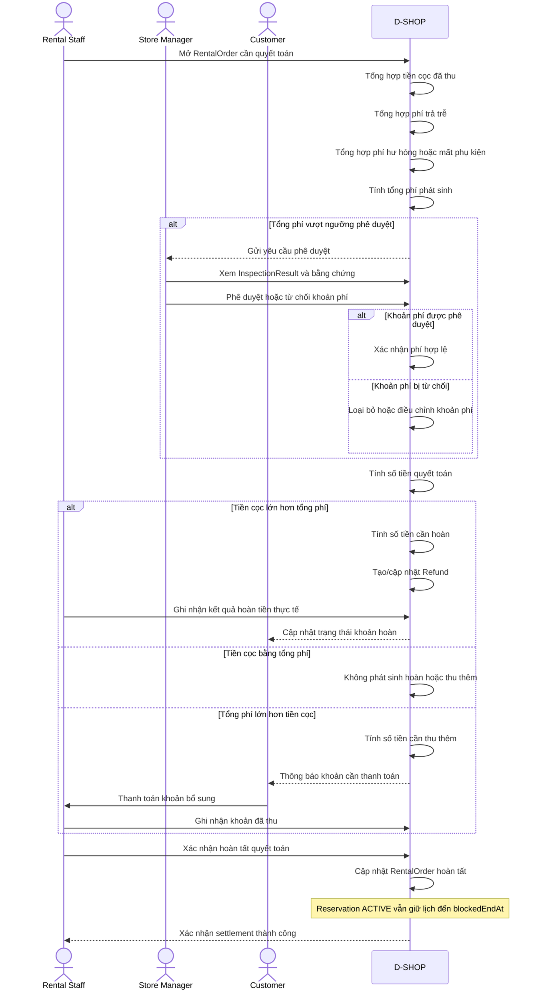

# P07 - Settlement

P07 mô tả cách D-SHOP tổng hợp các khoản phí sau hoàn trả, xử lý phê duyệt nếu cần, tính số tiền hoàn cọc hoặc cần thu thêm và hoàn tất RentalOrder.

## Actors

- Rental Staff
- Store Manager
- Customer
- D-SHOP

## Main Flow

## Integration Boundary

- Payment Service xử lý/xác nhận khoản thanh toán điện tử được tích hợp.
- Refund là bản ghi nghiệp vụ theo dõi số tiền và trạng thái. Baseline hiện tại không giả định có API refund tự động từ Payment Service.
- Job vòng đời Reservation chỉ chuyển Reservation đủ điều kiện sang `COMPLETED` sau khi RentalUnit đã trả và `now >= blockedEndAt`.
