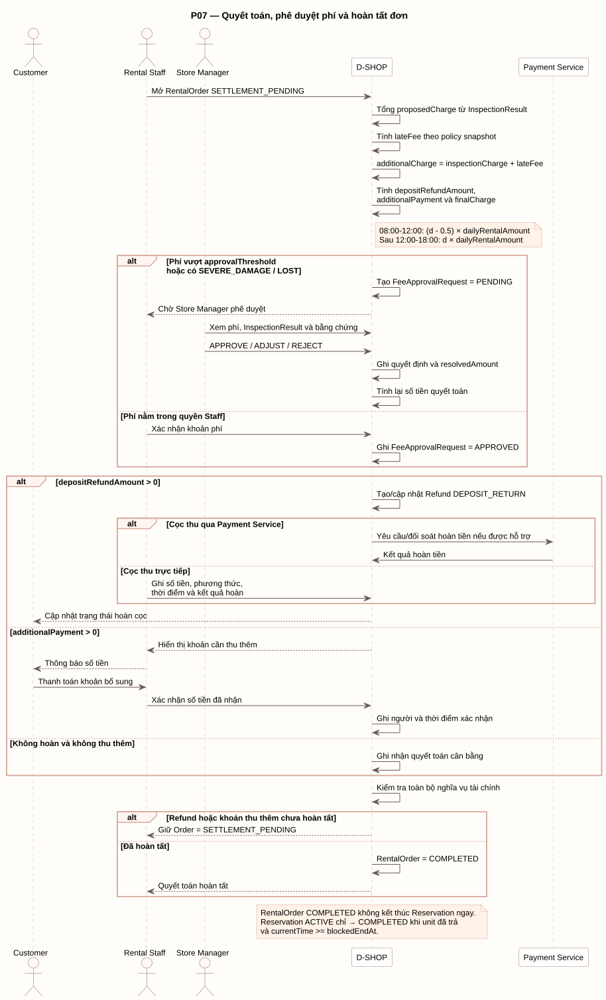

# P07 - Quyết toán, phê duyệt phí và hoàn tất đơn

P07 mô tả tổng hợp phí, phê duyệt, hoàn cọc hoặc thu thêm và hoàn tất RentalOrder.

[PlantUML source](../assets/diagrams/p07-settlement.puml)

## Actors

- Customer
- Rental Staff
- Store Manager
- D-SHOP
- Payment Service, trong phạm vi thanh toán/hoàn tiền điện tử được tích hợp

## Flow Summary

1. Staff mở RentalOrder `SETTLEMENT_PENDING`.
2. D-SHOP tổng proposedCharge từ InspectionResult, tính lateFee theo policy snapshot, rồi tính `additionalCharge`, `depositRefundAmount`, `additionalPayment` và `finalCharge`.
3. Phí vượt `approvalThreshold` hoặc có `SEVERE_DAMAGE/LOST` tạo FeeApprovalRequest `PENDING`; Store Manager có thể `APPROVE`, `ADJUST` hoặc `REJECT`, sau đó hệ thống tính lại quyết toán.
4. Phí trong quyền Staff được xác nhận và ghi FeeApprovalRequest `APPROVED`.
5. Nếu cần hoàn cọc, hệ thống tạo/cập nhật Refund `DEPOSIT_RETURN`; kết quả chuyển tiền điện tử hoặc hoàn trực tiếp phải được ghi nhận.
6. Nếu cần thu thêm, Staff thông báo Customer, xác nhận số tiền đã nhận và hệ thống ghi người/thời điểm xác nhận.
7. RentalOrder chỉ chuyển `COMPLETED` khi toàn bộ nghĩa vụ hoàn/thu thêm đã hoàn tất; nếu chưa thì giữ `SETTLEMENT_PENDING`.

## Late Fee Boundary

- Trả từ 08:00 đến đúng 12:00 của ngày trễ thứ `d`: `(d - 0.5) x dailyRentalAmount`.
- Trả sau 12:00 đến 18:00: `d x dailyRentalAmount`.

## Integration Boundary

- Refund là bản ghi nghĩa vụ và trạng thái; baseline không mặc định Payment Service có API refund tự động.
- RentalOrder `COMPLETED` không kết thúc Reservation ngay. Reservation `ACTIVE` chỉ chuyển `COMPLETED` sau khi unit đã trả và `currentTime >= blockedEndAt`.
